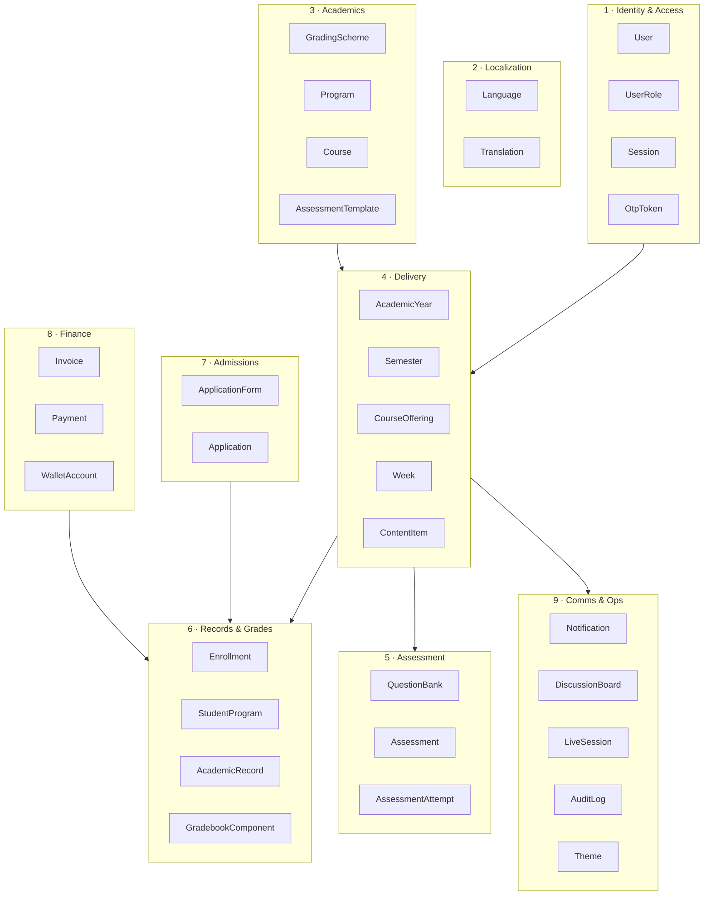
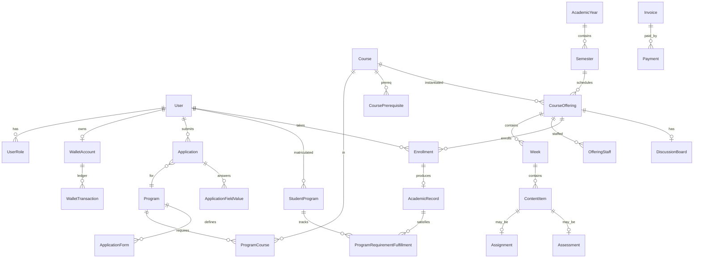

# Spims Entity Model Overview

**Version:** 1.0 · **Canonical schema:** `schema.prisma` (also copied to `prisma/schema.prisma`)  
**Traces to:** `spims-spec-v0.2.md` §1–15  
**Purpose:** Human-readable map of entities, relationships, and spec coverage. Use this for onboarding and design reviews; migrations always follow `schema.prisma`.

---

## Design principles

1. **Single institution** — no `School` tenant table. All data belongs to Spims.
2. **Money** — integer minor units + `Currency` (EGP | USD). Never floats. No conversion.
3. **i18n** — translatable fields use the `Translation` table `(entityType, entityId, field, locale)`; exams use `Assessment.language` (single language, no AI translate).
4. **Audit** — every mutation via `withAudit()` → `AuditLog`. Actor IDs on domain rows are optional shortcuts; audit log is source of truth.
5. **Academic records are program-agnostic** — `AcademicRecord` enables cross-program credit reuse via `ProgramRequirementFulfillment`.
6. **Wallet** — append-only `WalletTransaction` ledger; four cached balances on `WalletAccount` (derived, reconcilable).

---

## Context map (9 bounded contexts)

---

## Entity catalog by spec section

### §1 Roles · §7 Accounts

| Model | Purpose | Key fields / relations |
|---|---|---|
| `User` | Person (may hold multiple roles) | `email`, `phone`, `countryCode` (pricing region), `isReviewer`, `status` |
| `UserRole` | Role assignment | `role: RoleType` — union of 7 roles |
| `Session` | HttpOnly session token | `token`, `expiresAt` |
| `OtpToken` | Email verification / password reset | `purpose`, `codeHash`, `consumedAt` |

**Spec coverage:** email OTP signup, multi-role, round-robin reviewer flag (`isReviewer`, `lastReviewedAt`).

---

### §2 Localization

| Model | Purpose |
|---|---|
| `Language` | Enabled locales (`ar`, `en`, `fr`); `isRtl` for Arabic |
| `Translation` | Stored AI/human translations with `verified` flag |

**Not translated:** exam prompts (`Assessment.language` fixed at authoring).

---

### §6 Academic model

| Model | Purpose | Spec mapping |
|---|---|---|
| `GradingScheme` | Letter → GPA → % bands | §6 grading scheme |
| `GradeBand` | One band row per letter | `minPercent`, `maxPercent`, `gpaPoints`, `isPassing` |
| `AssessmentTemplate` | Default weighted components (sum 100%) | §6 assessment criteria |
| `AssessmentTemplateComponent` | Component name + weight + `ComponentKind` | |
| `Program` | Diploma / certificate / degree | §6 programs; caps, signatory, `electiveCreditsRequired` |
| `ProgramCourse` | Required vs elective link | `requirement: REQUIRED \| ELECTIVE` |
| `Course` | Catalog course | code, credit hours, USD/EGP prices, `isStandalone`, `isFree`, prerequisites |
| `CoursePrerequisite` | Directed prereq graph | §6 prerequisite enforcement |
| `CourseInterestFlag` | Student interest in dormant course | §6 interest flags |

---

### §6 Semesters · §8 Enrollment windows

| Model | Purpose |
|---|---|
| `AcademicYear` | e.g. 2026/2027 |
| `Semester` | Term dates + `registrationStart/End`, `addDropEndWeek`, `lastWithdrawalWeek`, `withdrawalRefundPercent` |

---

### §6 Offerings · §9 LMS content · §12 Live sessions

| Model | Purpose |
|---|---|
| `CourseOffering` | Semester run or self-paced (`mode`, `semesterId?`, seat cap, attendance threshold) |
| `OfferingStaff` | Instructor / TA assignment |
| `Week` | Ordered units; `unlockDate` for cohort gating |
| `ContentItem` | VIDEO, READING, TEXT, ASSIGNMENT, QUIZ, EXAM, DISCUSSION |
| `Assignment` | Linked to content item + gradebook component |
| `AssignmentSubmission` | File and/or text; late flag; raw/final score |
| `SessionRecurrence` | Recurring live schedule |
| `LiveSession` | Zoom meeting instance + recording URL |
| `AttendanceRecord` | Present/absent from Zoom import or manual override |

**Self-paced rules** (enforced in services, not extra tables): unlock next week on prior completion; no attendance component; lightweight Q&A board only.

---

### §10 Assessment engine

| Model | Purpose |
|---|---|
| `QuestionBank` | Per-course question pool |
| `Question` | All `QuestionType` values; `config` JSON for matching/fill-blank/etc. |
| `QuestionOption` | MCQ options; `matchKey` for matching type |
| `Assessment` | Quiz or exam mode; timing, attempts, shuffle, draw-from-bank, integrity flags |
| `AssessmentQuestion` | Questions attached to an assessment instance |
| `AssessmentAttempt` | Server `dueAt`; `focusLossCount`; status lifecycle |
| `AttemptAnswer` | Autosaved `response` JSON; `aiSuggestedScore` + `finalScore` for essays |

---

### §11 Gradebook · §6 GPA & records

| Model | Purpose |
|---|---|
| `GradebookComponent` | Per-offering weighted components |
| `Enrollment` | Student in offering; final grade snapshot; `gradeStatus` lock |
| `StudentProgram` | Matriculated program; `cachedGpa` |
| `AcademicRecord` | Program-agnostic pass record (cross-program reuse) |
| `ProgramRequirementFulfillment` | Links record → program requirement |
| `Credential` | Transcript / program cert / standalone cert; `serial`, `qrToken` |

**Grade types:** `GradeType` enum — STANDARD, WITHDRAWAL (W), PASS_FAIL, AUDIT (AU), IN_PROGRESS (IP).

---

### §7 Admissions

| Model | Purpose |
|---|---|
| `ApplicationForm` | Per-program form definition |
| `ApplicationFormField` | Field type, order, required, allowed file types, admin notes |
| `Application` | Applicant submission; `status` workflow; `reviewerId` round-robin |
| `ApplicationFieldValue` | Answers + uploaded document URLs |

**Workflow:** DRAFT → SUBMITTED → UNDER_REVIEW → ACCEPTED | REJECTED | WAITLISTED → matriculate → `StudentProgram`.

---

### §5 Finance · §8 Refunds

| Model | Purpose |
|---|---|
| `Invoice` / `InvoiceLine` | Billing on enrollment |
| `Payment` | Gateway or manual; `receiptSerial`, `receiptUrl`, verification actors |
| `WalletAccount` | Four cached balance columns |
| `WalletTransaction` | Append-only ledger (money/points × EGP/USD) |
| `Refund` | Request/approve; `asPoints` discretion |
| `Donation` | Wallet or gateway donation |

---

### §13 Discussions · §15 Notifications

| Model | Purpose |
|---|---|
| `Announcement` | Offering-scoped; translatable |
| `DiscussionBoard` | One per offering; `allowStudentThreads` |
| `DiscussionThread` | Graded or not; participation minimums; visibility |
| `DiscussionPost` | Threaded replies; attachments; soft delete |
| `DiscussionGrade` | Auto + override score per student per thread |
| `Notification` | In-app (+ email via jobs); `readAt` |

---

### §3 Ops · §14 Branding

| Model | Purpose |
|---|---|
| `AuditLog` | Central audit trail |
| `Setting` | System keys (late penalty curve, default attendance threshold, zoom hosts) |
| `Theme` | Admin branding + light/dark design tokens |

---

## Core relationship diagram

---

## Spec traceability matrix

| Spec § | Primary models | Service layer (planned) |
|---|---|---|
| 1 Roles | `User`, `UserRole` | `lib/auth/authorize.ts` |
| 2 i18n | `Language`, `Translation` | `lib/i18n`, `lib/ai/translate` |
| 5 Payments | `Invoice`, `Payment`, `Wallet*` | `lib/services/finance/*` |
| 6 Academics | `Program`, `Course`, `GradingScheme`, `AssessmentTemplate` | `lib/services/academics/*` |
| 7 Admissions | `Application*` | `lib/services/admissions/*` |
| 8 Enrollment | `Semester`, `Enrollment` | `lib/services/enrollment/*` |
| 9 LMS | `Week`, `ContentItem`, `Assignment` | `lib/services/content/*` |
| 10 Exams | `Question*`, `Assessment*`, `Attempt*` | `lib/services/assessment/*` |
| 11 Gradebook | `GradebookComponent`, `Enrollment`, `AcademicRecord` | `lib/services/gradebook/*` |
| 12 Live | `LiveSession`, `AttendanceRecord` | `lib/zoom`, `lib/services/attendance/*` |
| 13 Discussions | `Discussion*` | `lib/services/discussions/*` |
| 14 Credentials | `Credential` | `lib/services/credentials/*` |
| 15 Notifications | `Notification` | `lib/email`, BullMQ jobs |

---

## E School entity mapping (what NOT to port)

| E School entity | Spims equivalent | Notes |
|---|---|---|
| `School` (tenant) | — | Removed; single institution |
| `ClassSchool` / `ClassSection` | `CourseOffering` | Different enrollment model |
| `Subject` | `Course` (catalog) | Catalog vs class-bound |
| `SessionYear` | `AcademicYear` + `Semester` | Spims semesters drive registration |
| `Students` (K–12 record) | `User` + `Enrollment` + `StudentProgram` | Admissions + matriculation |
| `Fees` / `FeesPaid` | `Invoice` / `Payment` / `Wallet*` | Regional dual currency + wallet |
| `OnlineExam*` | `Assessment*` / `Question*` | Richer engine in Spims |
| `Lesson` / `LessonTopic` | `Week` / `ContentItem` | Week-gated structure |
| `Guardian` | — | Not in Spims v1 |
| `Subscription` / `Package` | — | B2B SaaS only in E School |

---

## Model count summary

| Context | Models |
|---|---|
| Identity & access | 4 |
| Localization | 2 |
| Academics | 8 |
| Semesters & offerings | 2 + 5 content/live |
| Assessment engine | 7 |
| Gradebook & records | 6 |
| Admissions | 4 |
| Finance | 7 |
| Communications | 6 |
| Audit & settings | 3 |
| **Total** | **~54** (including join/fulfillment tables) |

---

## Implementation order

Entities should be migrated in phase order (see `claude-code-build-brief.md`):

1. **Phase 0:** All models in one initial migration (schema is pre-designed).
2. **Phase 1:** User, UserRole, Session, OtpToken, Theme, AuditLog, Setting.
3. **Phase 2:** GradingScheme through CourseInterestFlag, Translation.
4. **Phase 3:** AcademicYear through ContentItem, LiveSession skeleton.
5. **Phase 4:** Application* + Enrollment rules.
6. **Phase 5:** Invoice through Refund.
7. **Phase 6:** Question* through AcademicRecord, Credential.
8. **Phase 7:** Discussion*, Notification jobs, attendance import.

Services enforce cross-cutting rules (prerequisites, seat caps, financial holds, grade lock, wallet ledger integrity) — the schema stores state; services enforce spec behavior.

---

## Related documents

- **`spims-spec-v0.2.md`** — product requirements (source of truth for *what*)
- **`schema.prisma`** — canonical Prisma schema (source of truth for *data*)
- **`eschool-gap-analysis.md`** — why not to adapt E School SAAS
- **`claude-code-build-brief.md`** — phased implementation plan
- **`permissions-matrix.md`** — which role can mutate which entity
